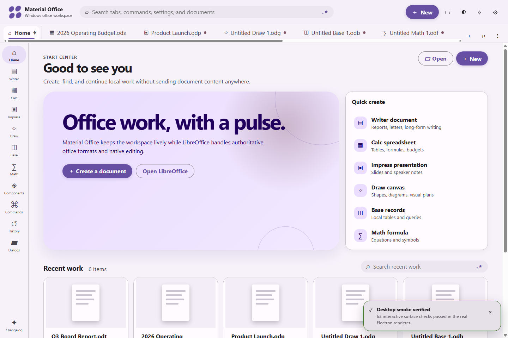

# Material Office

Material Office is a Windows-only Electron workspace with original local editing models and an explicit bridge to an installed LibreOffice. The Electron app owns its shell, local state, search, tabs, appearance, notifications, and append-only history; LibreOffice remains the authoritative engine for native office-format editing, conversion, and UNO commands.

> **Release:** `0.1.0` · **Classic Har Gow · 蝦餃**. Every published installer is produced and tested by the default-branch workflow before its documentation site is deployed. The workflow run, immutable tag, release assets, attestations, and deployment remain the authoritative evidence for a particular build.

**Install:** [download the latest verified Windows x64 installer](https://github.com/Ding-Ding-Projects/material-office/releases/latest/download/Material-Office-0.1.0-x64-Setup.exe). The installer is currently Authenticode-unsigned, runs per-user without elevation, and carries repository/workflow build-provenance attestation plus an attached SHA-256 checksum.

**Documentation:** [open the Material Office site](https://ding-ding-projects.github.io/material-office/).

## Screenshots

The following capture comes from the packaged Windows smoke run, with the Material Design start center rendered by the actual Electron build:



_Verified capture: packaged smoke run, 2026-07-31; the same run exercised Writer, Calc, Impress, Draw, Base, Math, tabs, appearance, history, notifications, and the LibreOffice bridge._

## Contents

- [What works](#what-works)
- [Run locally](#run-locally)
- [Documentation](#documentation)
- [Security and scope](#security-and-scope)
- [Shared agent contract](#shared-agent-contract)

## What works

- Secure Windows Electron runtime with sandboxed renderer, context isolation, validated IPC, and no remote assets.
- Local Writer rich text, Calc grids and bounded formulas, Impress slide records, Draw basic shapes, Base local records/query/form/report views, and Math formula rendering, all with workspace persistence. These models do not claim native ODF/OOXML fidelity.
- Explicit LibreOffice discovery, native-document launch, allowlisted conversion, and catalog-locked UNO dispatch. Those workflows require a compatible LibreOffice installation and remain LibreOffice-owned operations.
- A searchable local catalog of 2,433 LibreOffice command records. Catalog presence documents an exact UNO URI; it does not mean every command is reimplemented in Electron or available in every LibreOffice context.
- Browser-style tabs with pinning, groups, reorder, four searches, regex builders, protected bulk close, and restart persistence.
- English, playful Hong Kong Cantonese, and compact bilingual modes, plus independent 1–5 funny levels.
- Per-element appearance controls, installed-font discovery, continuous color translation, theme import/export, theme, density, and scaling.
- Local Git-backed snapshots with a bundled checksum-pinned five-file runtime, restore-as-a-new-revision, date/action/text filters, notification history, and changelog export. Exact Git/libiconv/gettext corresponding-source assets and build recipes are release-gated.
- Material Office Word (`.mow`) saves package the document plus a verifiable Git bundle; every custom-document save is a local commit, and restoring creates a new commit so an undo can itself be undone.
- A bundled, opt-out 1% startup dim-sum surprise using the verified local catalog asset only.

## Run locally

```powershell
npm ci
npm test
npm start
```

Build the x64 Windows installer:

```powershell
npm run dist:win
npm run verify:package
```

`npm run dist:win` prepares only the proven `git.exe` plus four-DLL runtime. `npm run prepare:git-sources` separately verifies the primary-source archives and exact Git-for-Windows recipes that every release must attach. The gate relies on exact upstream URLs, byte lengths, and pinned SHA-256 values; it does not claim PGP signer authentication.

LibreOffice is discovered by verified absolute path. Windows file associations are never trusted because another office suite may own them.

## Documentation

The [live documentation site](https://ding-ding-projects.github.io/material-office/) contains product articles and generated details for the bundled command catalog. `landing/npm test` preserves the Vinext Sites build and also creates/tests the base-aware static Vite artifact used by GitHub Pages. Repository documentation is indexed in [docs/README.md](docs/README.md).

<details>
<summary><b>Editors and document behavior</b></summary>

- [Writer](docs/editors/writer.md)
- [Calc](docs/editors/calc.md)
- [Impress](docs/editors/impress.md)
- [Draw](docs/editors/draw.md)
- [Base](docs/editors/base.md)
- [Math](docs/editors/math.md)

</details>

<details>
<summary><b>Navigation, customization, and safety</b></summary>

- [Tabs, groups, search, and regex](docs/customization/tabs-search-regex.md)
- [Appearance and localization](docs/customization/appearance-localization.md)
- [Notifications and accessibility](docs/customization/notifications-accessibility.md)
- [Local version history](docs/data/version-history.md)
- [Changelog and release identity](docs/data/changelog.md)

</details>

<details>
<summary><b>Integration and release engineering</b></summary>

- [LibreOffice integration](docs/integration/libreoffice.md)
- [UNO command broker](docs/integration/uno-command-broker.md)
- [External editor integration](docs/integration/external-editors.md)
- [Windows installer and CI](docs/release/windows-installer.md)
- [Landing and documentation site](docs/release/documentation-site.md)
- [Licensing, third-party notices, and image provenance](docs/legal/README.md)

</details>

## Security and scope

Material Office is intentionally Windows-only. It does not embed or copy another office suite’s editor engine. Original app code coordinates files and state; LibreOffice is the sole external office codebase used as a behavioral reference and integration target.

The implemented app paths do not send document content, search patterns, or sample text to a service. Conversion jobs use argument arrays, unique profiles, allowlisted formats, bounded output, timeouts, and checked output files. See [SECURITY.md](SECURITY.md) for reporting and [THIRD_PARTY_NOTICES.md](THIRD_PARTY_NOTICES.md) for packaged-runtime obligations.

## Shared agent contract

<details>
<summary><b>Sanitized mirror — read before changing this repository</b></summary>

This is a public-safe mirror of the shared working agreement. The canonical private instructions remain authoritative; update them first when the agreement changes.

- Preserve the Windows-only Electron scope. Do not modify or revive unrelated terminal interfaces.
- Write original application code. LibreOffice is the only external office application whose behavior or APIs may be used as a reference.
- Keep the renderer sandboxed, IPC narrow and validated, file/process paths main-owned, and document data local by default.
- Maintain Material Design 3, accessibility, narrow/bilingual layouts, three language modes, and independent funny-level controls.
- Every search surface keeps plain text as the default and provides an adjacent full regex builder with bounded local evaluation.
- Maintain tab pinning, grouping, four tab searches, protected reviewed bulk close, and persisted structure.
- Keep per-element appearance editing, continuous color translation, typography depth, import/export, and reset behavior functional.
- Keep append-only local history for app-owned documents, records, and settings; restores create new revisions.
- Use only the repository’s verified dim-sum catalog assets. Do not generate, download, or scrape replacement imagery.
- Update feature documentation, roadmap, handoff, landing site, wiki, Pages source, tests, and changelog with behavior changes.
- Every push and manual workflow dispatch is test-gated and produces one uniquely tagged Windows installer release plus its checksum, verified dim-sum image, provenance/legal records, and exact corresponding-source assets. Pages deploys only from the default branch.
- Use `git` for local version control and `gh` for GitHub operations. Preserve unrelated work and never force-push without explicit authorization.
- Do not expose credentials, private host details, usernames, absolute external paths, or internal conversational vocabulary in public files.

The complete project-local mirror is in [AGENTS.md](AGENTS.md).

</details>

## Repository tabs

[Contributing](CONTRIBUTING.md) · [Security](SECURITY.md) · [Code of Conduct](CODE_OF_CONDUCT.md) · [License](LICENSE) · [Third-party notices](THIRD_PARTY_NOTICES.md)
